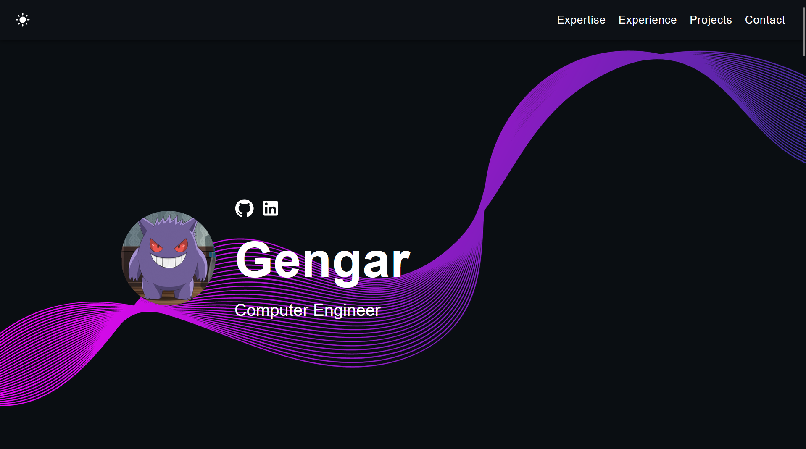
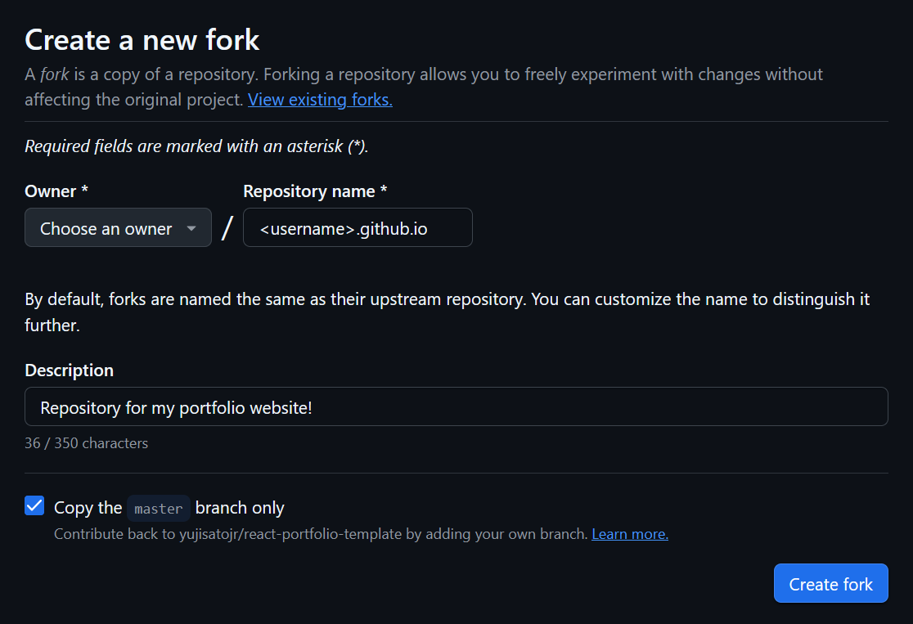
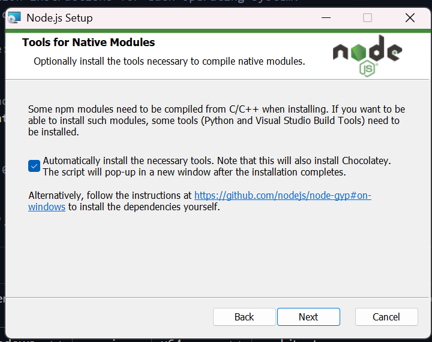

# Developer Portfolio Template 🚀

      

## What is this?

This simple portfolio template is designed to showcase your past projects, career history, skill sets, and more.

View the [Demo](https://lotusey.github.io/CS-Portfolio-Template/).

**This template was originally made by (https://github.com/yujisatojr). It is free to use, and no attribution is required.** You can fork or download this repository to customize it for your own use.



## Features

✅ Open source (free to use, no attribution required)  
✅ Responsive design & mobile-friendly  
✅ Supports both dark and light modes  
✅ Highly customizable multi-component layout  
✅ Built with modern technologies (React, TypeScript, JavaScript, and SCSS)  

## Quick Setup

1. Set up a GitHub Account:
    - Visit GitHub: If you don't have an account, go to [GitHub](https://Github.com) and sign up.
    - Create an Account: Fill out the registration form with your preferred username, email, and password. Since your username will be the start of your web page's handle, try to make your username your name, or something easily read aloud. 
    - Verify Your Email: Check your email to verify your account

2. Using the Template:
    - Navigate to the [CS-Portfolio-Template](https://github.com/Lotusey/CS-Portfolio-Template) Repository.
    - Click on the "Fork" button on the top right. 
    
    - Choose the owner (you), name the repository "(username).github.io", and add a description. 
     
    - Now the repo should be forked!

3. Open VSCode (or your code editor of choice) and clone the repo. 
    - If not already connected, log in to GitHub via VSCode by clicking on the account icon in the bottom left of the window. 
    - Once logged in, Click on the "Explorer" tab in the top left > "Clone Repository" > Clone from GitHub > Select "(Username)/(Username).github.io ..."
    
    - Now you should have the repository cloned locally and the workspace open.

4. Now we'll need to ensure that you have [Node.js](https://nodejs.org/) installed. Open a terminal by pressing 'Ctrl+Shift+`'. Now check your installation by running:

    ```bash
    node -v
    ```
    - It should return a version number (ex. v24.14.0). If it does not then download the latest version of [Node](https://nodejs.org/dist/v24.21.0/node-v24.21.0-x64.msi). 

    - Run the installer, click next until you reach 
     and click the check mark for "Automatically install..."

    - Restart VSCode to ensure it recognizes that Node is now installed, and repeat the start of step 4. 

5. In the project directory, install dependencies:

    ```bash
    npm install
    ```

6. Start the development server:

    ```bash
    npm start
    ```

7. Open [http://localhost:3000](http://localhost:3000) to view the app in the browser.

8. Open `src/data/portfolio.json` and replace the example information with your own. The page updates from this file; you do not need to edit the React components.

The profile file contains your name and title, social links, expertise and technologies, experience, projects, and contact-section text. Add your images to `public/images/` and use paths such as `images/profile.jpg` or `images/project.jpg` in the JSON. You can also use a full image URL.

Set `contact.recipientEmail` in `src/data/portfolio.json` to the address that should receive contact messages. The form opens the visitor's default email app with the message prefilled; they still need to review and send it. A static GitHub Pages site cannot send email directly without connecting an email service or backend.

The page will reload if you make edits, and you will see any lint errors in the console.

If you are interested in creating a mockup image like the ones from the personal projects section, I recommend [Genmoo](https://gemoo.com/tools/browser-mockup-generator/). This website lets you generate sleek looking browser mockups for free.

## Deployment

Now we'll host the website via GitHub pages!
(You can also choose a different preferred service (e.g., [Netlify](https://www.netlify.com/), [Render](https://render.com/), [Heroku](https://www.heroku.com/)) for deployment, but GitHub pages is the easiest for our purposes.) Follow the instructions below for a production deploy.

1. **Configure `package.json`**

    Edit the following properties in your `package.json` file:

    ```json
    {
        "homepage": "https://yourusername.github.io",
        "scripts": {
            "predeploy": "npm run build",
            "deploy": "gh-pages -b main -d build",
            ...
        }
    }
    ```

    Replace `yourusername` with your GitHub username and `your-repo-name` with the name of your GitHub repository.

2. **Install gh-pages**
    ```
    npm install --save gh-pages
    ```

3. **Deploy to GitHub Pages**

    Run the following command to deploy your app:

    ```bash
    npm run deploy
    ```

4. Ensure project settings use gh-pages
    - Go back to the repository on Github
    - Go to settings > Pages
    - Then under Build and Deployment and under Branch select 'gh-pages' and press Save
    


5. **Access Your Deployed App**

    After successfully deploying, you can access your app at `https://yourusername.github.io/your-repo-name`.